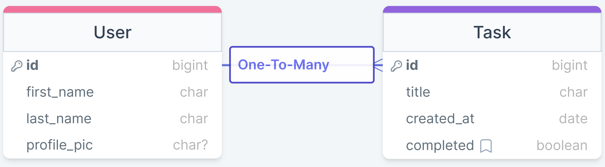

# TODO APP - Day2Day
- Fullstack application for mobile with the stretch goal of making it responsive depending on the user's device. 
- The App will allow users to `create` new tasks, `update` existing tasks, `delete` a task/set of tasks, and `read` both pending and/or completed task.

## Tech Stack:

 
<ul>
  <li style="display: flex; flex-direction: row; gap: 2%">FRONTEND: 
  
   

  

  

  

  

  </li>
   
  <li style="display: flex; flex-direction: row; gap: 5%">BACKEND: 
  
  

  

  

  
  
  
  </li>
   
  <li style="display: flex; flex-direction: row; gap: 5%">TESTING: 
  
  
  
  </li>
</ul>

## Implementation:

<ul>
  <li>React/TS: Layout content</li>
  <li>CSS: Style Content</li>
  <li>Django/Python: API interaction with PostgreSQL Database</li>
  <li>JEST: Testing framework to conduct Test-Driven Development</li>
</ul>

## Design

 

## Database Schema

 

- A USER will have a First Name and Last Name and a Profile Picture that can be left blank. 
- A USER can have many (one-to-may relationship) TASKs
- A TASK will have a Title, a Date when it was created, and a Completed status that is defaulted to `false` (i.e. "Pending")

## License

